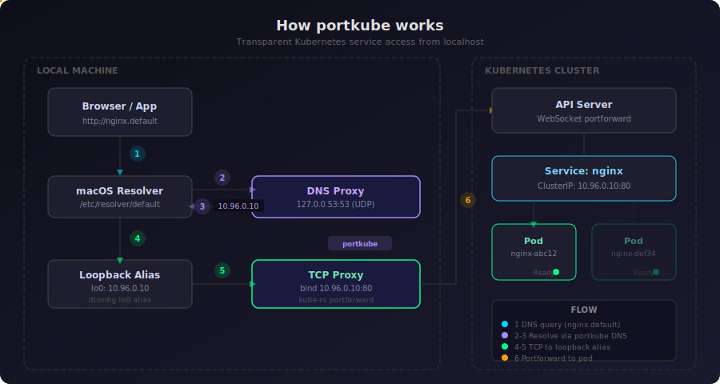

# portkube - Access Kubernetes Services from Localhost

**portkube** is a terminal UI that lets you access Kubernetes cluster services by their DNS names from your local machine — no manual port-forwarding, no port collisions, no cluster-side agents.

Just run `sudo portkube`, pick a context, and `http://nginx.default` works in your browser.

---

[](LICENSE)
[](https://www.rust-lang.org/)

---

## How It Works

<div align="center">
  
</div>

portkube sets up a transparent network bridge between your machine and the Kubernetes cluster:

1. **DNS query** — Your browser resolves `nginx.default` via macOS's `/etc/resolver/` system
2. **DNS proxy** — portkube's DNS server on `127.0.0.53:53` matches the query against known services
3. **IP resolution** — Returns the service's ClusterIP (e.g., `10.96.0.10`)
4. **Loopback alias** — Traffic hits a loopback alias bound to that ClusterIP
5. **TCP proxy** — portkube's TCP listener on that IP proxies the connection
6. **Portforward** — `kube-rs` opens a WebSocket portforward to the backing pod

Each service keeps its original port. Three services on port 80? No problem — each gets its own ClusterIP on loopback.

---

## Features

- **Zero Dependencies** — No sidecar, no cluster-side agent, single binary
- **No Port Collisions** — Each service gets its own loopback IP, keeping original ports
- **Short DNS Names** — Access services as `nginx.default` instead of `nginx.default.svc.cluster.local`
- **Multi-Context** — Switch between cluster contexts from the TUI
- **Service Dashboard** — Browse all services with name, namespace, type, and ports
- **Quick Access** — Open service URLs in browser or copy to clipboard
- **Clean Teardown** — All network changes are reversed on disconnect or exit

---

## Installation

### From Source

portkube is built with Rust (2024 edition). Make sure you have Rust installed.

```bash
git clone https://github.com/huseyinbabal/portkube.git
cd portkube
cargo build --release
sudo cp target/release/portkube /usr/local/bin/
```

### Using Cargo

```bash
cargo install portkube
```

---

## Quick Start

```bash
# portkube requires root for network setup (loopback aliases, DNS, utun)
sudo portkube
```

1. Select a Kubernetes context from the list
2. Wait for services to be discovered and proxies to start
3. Access any service from your browser or terminal:

```bash
curl http://nginx.default
curl http://my-api.staging:8080
psql -h postgres.default -p 5432
```

---

## Key Bindings

| Action | Key | Description |
|--------|-----|-------------|
| **Navigation** | | |
| Move up | `k` / `Up` | Move selection up |
| Move down | `j` / `Down` | Move selection down |
| **Actions** | | |
| Select / Connect | `Enter` | Connect to context or open service URL |
| Open in browser | `o` | Open selected service in browser |
| Copy URL | `y` | Copy service URL to clipboard |
| Refresh | `r` | Refresh context or service list |
| Disconnect | `Esc` / `Backspace` | Disconnect and return to context selector |
| Quit | `q` / `Ctrl-c` | Clean up and exit |

---

## Requirements

- **macOS** (see [Platform Support](#platform-support) for Linux/Windows status)
- **Root access** — Required for utun device, loopback aliases, and `/etc/resolver/` configuration
- **Valid kubeconfig** — `~/.kube/config` with at least one context
- **Cluster access** — Your kubeconfig must have permissions to list services and portforward to pods

---

## How It Works (Details)

### Network Setup

When you connect to a context, portkube:

1. **Detects the service CIDR** — Creates a dummy service to extract the CIDR from the API server error message
2. **Creates a utun device** — Registers the cluster subnet route on your machine
3. **Discovers services** — Lists all services across namespaces
4. **For each service:**
   - Adds a loopback alias (`ifconfig lo0 alias <ClusterIP>`)
   - Resolves the backing pod via label selector
   - Binds a TCP listener on `<ClusterIP>:<port>`
   - Proxies connections to the pod via `kube-rs` portforward
5. **Installs DNS** — Creates `/etc/resolver/<namespace>` files and starts a UDP DNS proxy on `127.0.0.53:53`

### Cleanup

On disconnect or exit, everything is reversed:
- All proxy tasks are stopped
- Loopback aliases are removed
- `/etc/resolver/` files are deleted (backups restored)
- utun route is removed

---

## Platform Support

| Platform | Status |
|----------|--------|
| macOS | Tested |
| Linux | Not tested yet |
| Windows | Not tested yet |

---

## Roadmap

- [ ] Linux support (TUN device + systemd-resolved integration)
- [ ] Windows support (TUN device + DNS client configuration)
- [ ] Health check loop with auto-reconnect
- [ ] Service filtering by namespace/label
- [ ] Bookmark services for auto-connect
- [ ] Configuration file support
- [ ] Connection latency display

---

## Acknowledgments

- Built with [Ratatui](https://github.com/ratatui-org/ratatui) — Rust TUI library
- Powered by [kube-rs](https://github.com/kube-rs/kube) — Kubernetes client for Rust
- Inspired by [k9s](https://github.com/derailed/k9s)

---

## License

This project is licensed under the MIT License - see the [LICENSE](LICENSE) file for details.
